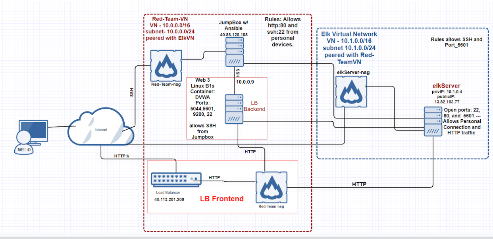
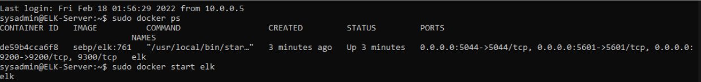

## Automated ELK Stack Deployment

The files in this repository were used to configure the network depicted below.

These files have been tested and used to generate a live ELK deployment on Azure. They can be used to either recreate the entire deployment pictured above. Alternatively, select portions of the playbook files may be used to install only certain pieces of it, such as Filebeat.

- [My Elk Playbook.](./Linux/ElkPB.yml) 
- [My Filebeat-Playbook.](./Linux/filebeat-playbook.yml)
- [My metricbeat-playbook.](./Linux/metricbeat-playbook.yml)
- [My playbook.](./Linux/Playbook.yml)
- [My Playbook to run all playbooks.](./Linux/RunAllYamlScripts.yml)

This document contains the following details:
- Description of the Topologu
- Access Policies
- ELK Configuration
  - Beats in Use
  - Machines Being Monitored
- How to Use the Ansible Build

### Description of the Topology

The main purpose of this network is to expose a load-balanced and monitored instance of DVWA, the D*mn Vulnerable Web Application.

Load balancing ensures that the application will have more reliable availability.
- Load Balancers protect against Denial-of-Service (DoS) and Distributed Denial-Of-Service (DDoS) attacks by allowing webservers to divide and conquer influxes of traffic by sharing resources to host a DVWA as shown in this exercise. The avantage of a jumpbox is so we can connect / montior multiple servers from a single machine, and restrict everyone else from connecting to those machines aswell._

Integrating an ELK server allows users to easily monitor the vulnerable VMs for changes to the data and system logs.
- _Filebeat_ forwards and centralizes log data. It monitors the log files and locations that you specify; then forwards them to Elasticsearch.
- _Metricbeat_ takes metrics and stats from your system and services running on the server, and sends to to Elasticsearch.

The configuration details of each machine may be found below.

| Name      | Function | IP Address | Operating System |
|-----------|----------|------------|------------------|
| Jump Box  | Gateway  | 10.0.0.5   | Linux            |
| ElkServer | Server   | 10.1.0.4   | Linux            |
| Web 3     | Server   | 10.0.0.9   | Linux            |

### Access Policies

The machines on the internal network are not exposed to the public Internet. 

Only the Jumpbox machine can accept connections from the Internet. Access to this machine is only allowed from the following IP addresses:
- My Personal IP Address

Machines within the network can only be accessed by JumpBox Provisoner.
- I allowed the jumpbox provisioner to access my ElkVM the IP addresses are 10.0.0.5 and 40.86.120.108

A summary of the access policies in place can be found in the table below.

| Name     | Publicly Accessible | Allowed IP Addresses |
|----------|---------------------|----------------------|
| Jump Box | Yes                 | My Personal IP Addr  |
| Web 3    | No                  | 10.0.0.5             |
| ElkServer| No                  | 10.0.0.5             |

### Elk Configuration

Ansible was used to automate configuration of the ELK machine. No configuration was performed manually, which is advantageous because...
- We can input multiple commands into multiple servers from a single yaml file. (:

The playbook implements the following tasks:
- The playbook installs a DVWA docker container, installs pip3, installs Docker-Python, and Enables Docker on boot. 
- The elkServer playbook deploys and launches a elk docker container with the published ports of 5601 9200 and 5044 and increased virtual memory. 
- The metricbeat and filebeat yml files are deployed onto the server and monitors logs.

The following screenshot displays the result of running `docker ps` after successfully configuring the ELK instance.

### Target Machines & Beats
This ELK server is configured to monitor the following machines:
- Web Server 3 - 10.0.0.9

We have installed the following Beats on these machines:
- We have installed Filebeat and Metricbeat onto the machines.

These Beats allow us to collect the following information from each machine:
- _Metricbeat_ collects metrics and statistics. _Filebeat_ collects, forwards, and centralizes log data.

### Using the Playbook
In order to use the playbook, you will need to have an Ansible control node already configured. Assuming you have such a control node provisioned: 

SSH into the control node and follow the steps below:
- Copy the /etc/ansible/filebeat-config.yml file to /etc/filebeat/filebeat.yml.
- Update the hosts file to include the WebServer(s) and ElkServer IP addresses.
- Run the playbook, and navigate to www.elkPubIP:5601 to check that the installation worked as expected.

**Bonus** _What is the command to run the playbook(s)?_ 
- ansible-playbook <nameOfPlaybook.yml>
